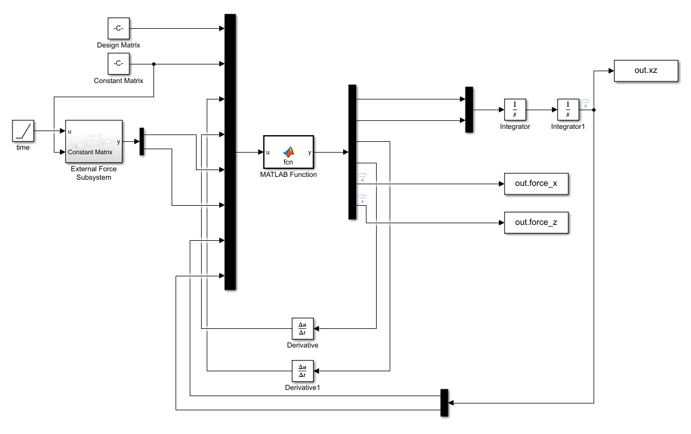
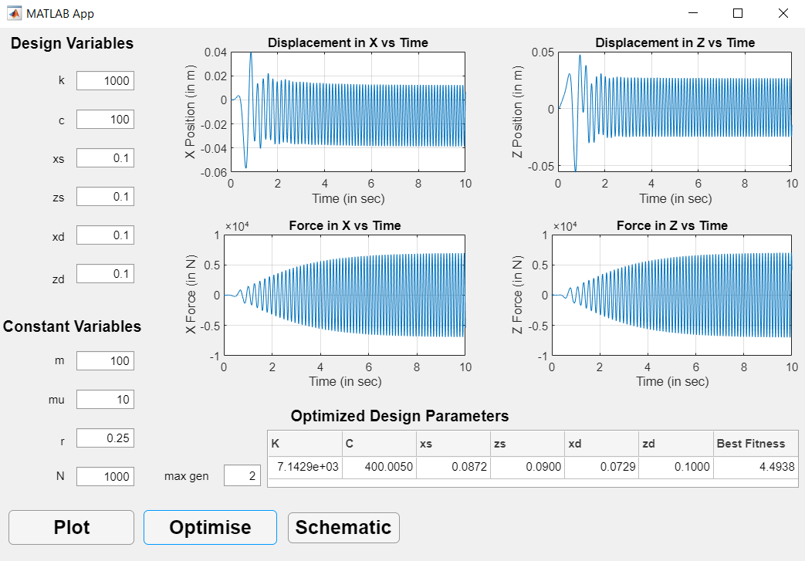
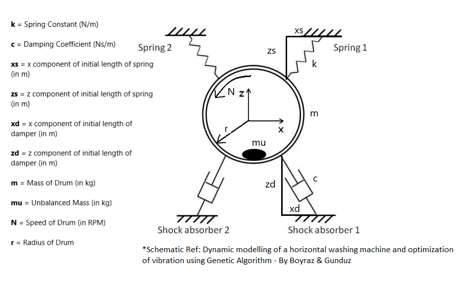
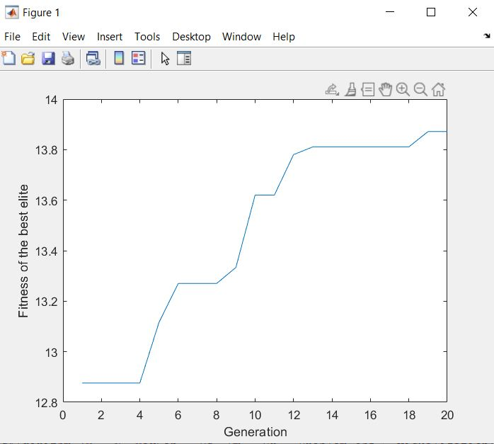
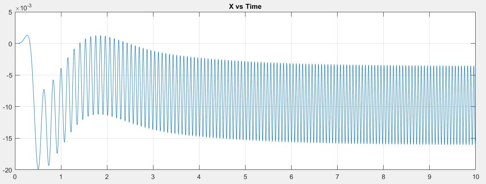
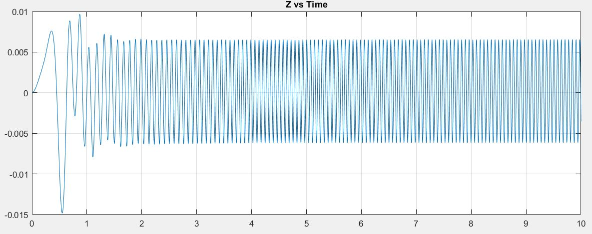
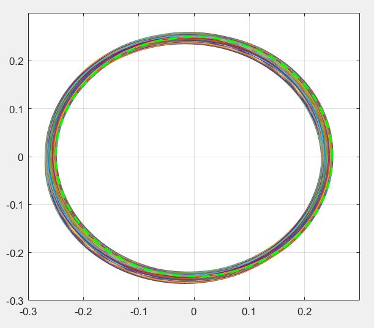

# Washing-Machine-Optimization-using-Genetic-Algorithm

## Introduction
This project examines vibrational characteristics of a 2D horizontal axis washing machine in both transient and steady state. A simulink model is developed to analyze the forces developed and the vibrations caused. To reduce the vibrations and improve the design proposal, an optimization scheme called Genetic Algorithms is utilized. 
This work is inspired from [Dynamic modeling of a horizontal washing machine and optimization of vibration characteristics using Genetic Algorithms](https://www.sciencedirect.com/science/article/abs/pii/S0957415813000974) by Pınar Boyraz and Mutlu Gündüz

## Contributions
* Abhishek Sabnis (Genetic Algorithm)
* K Srivatsan (Mathematical Model and Simulink)
* Amitanshu Sahoo (Genetic Algorithm)
* Sajal Maloo (Simulink and App development)

## Simulink model
The simulink model used is given below

## Dependencies
* MATLAB version 2021a
* MATLAB Simulink

## App Interface
The app interface is as below

## List of MATLAB files
* `Constant_Matrix.m` : Contains constant parameters of washing machine
* `crossover.m` : Crossover operation for Genetic Algo
* `decoder.m` : Decodes binary matrix to parameters
* `decoder_array.m` : Decodes resultant binary output to parameters
* `Design_matrix.m` : Contains design variables 
* `elitism2.m` : Contains elitism operation for Genetic Algo
* `fitness_fn` : Contains fitness function
* `GeneticAlgorithm.m` : Contains genetic algorithm code 
* `initialization.m` : Initializes random population
* `Main.m` : Run this code to get plots and animation
* `mutation.m` : Contains mutation function for Genetic Algo
* `plots.m` : Plots results and animation
* `Project_Model2021a.slx`: Simulink Model
* `selection.m`: Contains selection function for Genetic Algo
* `simRun.m`: Calls the simulink model
* `Washing_Machine.mlapp`: App made to identify optimized design variables

## Results obtained
Aim of project was to identify optimized parameters of washing machine such as spring constants, damper coefficients, positon of spring and dampers from center of mass. Image below shows the schematic. 

The results obtained after optimization are-
Fitness function-

x-position of center of mass

z-position of center of mass

Wobbling motion of washing machine-

